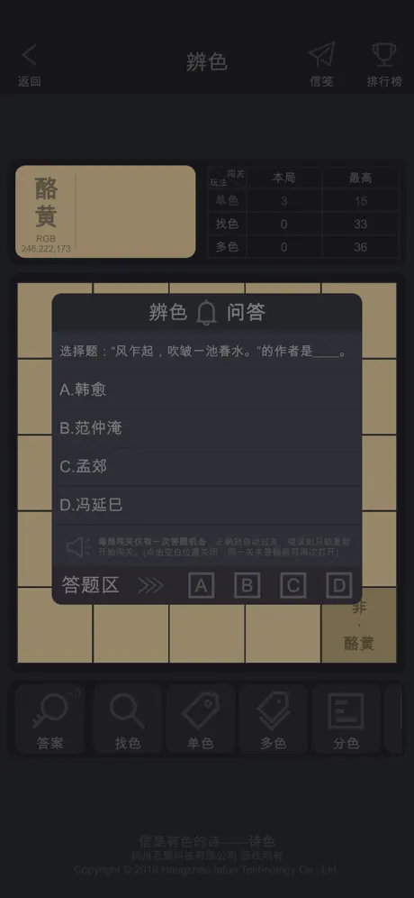
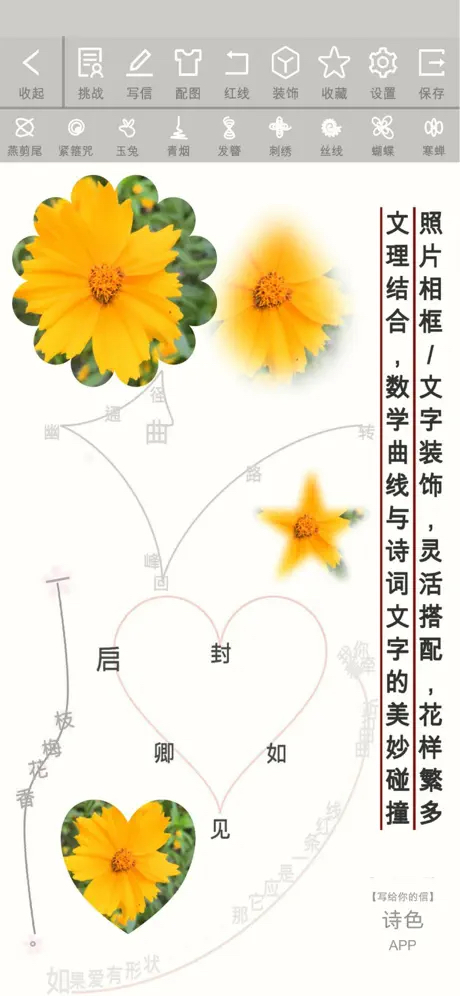
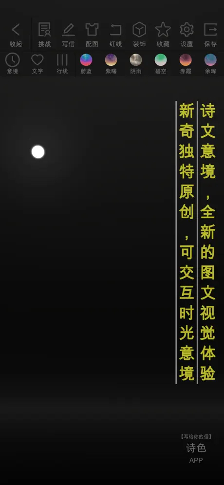

# GSSJ（诗色）

> **文字与色彩交织，诗意与艺术共生**

“诗色”是一款将中华诗词与色彩艺术完美融合的图文混排应用，以清新文艺的设计和创新玩法，带领用户在诗词与色彩的碰撞中释放创意、感受文化之美。无论是创作惊艳的图文作品，还是通过游戏化方式学习诗词，“诗色”都将为你带来如诗如画的沉浸式体验。

  
  
  
  
  

  
  
  
  
  

## APP下载体验

- **App Store**: [诗色](https://apps.apple.com/cn/app/%E8%AF%97%E8%89%B2/id1449364884)

> **诗词如画，色彩如歌；一创一玩，文化生辉。**

## 设计初衷

“欲寄彩笺兼尺素，山长水阔知何处。”“诗色”以诗词为魂、以色彩为媒，致力于通过科技与艺术的结合，弘扬中华传统文化。应用创新性地将诗词与函数曲线、色彩日记等元素融合，带来文理交融的独特体验，让每位用户都能创作属于自己的诗意画卷。

## 核心功能

- **诗词阅读与调整**：支持海量诗词，动态调节显示行数与阅读速度，沉浸式体验诗词之美。
- **多彩色卡与取色**：提供多种颜色选择，支持照片主色提取、自定义色卡与颜色信息编辑。
- **灵活排版创作**：多种布局与参数调整，支持自定义文字、图片与装饰，释放无限创意。
- **手势交互设计**：支持缩放、旋转、移动诗词、配图与脚注，打造个性化图文作品。
- **装饰与特效**：提供多样相框、滤镜与装饰图案，支持透明度与动态效果调整。
- **函数曲线融合**：将诗词与数学曲线结合，呈现文理交融的艺术体验。
- **时光意境画卷**：结合时间意境与诗文，生成可交互的独特图文作品。
- **诗词模糊查询**：满足日常诗词学习需求，快速检索唐诗、宋词、诗经等。
- **自动文案生成**：一键生成创意网文，助力社交分享与形式主义创作。
- **中文分词技术**：支持句子乱序重排、词性分析，探索中文语言的艺术性。

## 核心创新玩法

### 辨色识诗

通过色彩游戏与诗词学习的巧妙结合，玩家在轻松的闯关中感受文字与色彩的魅力。玩法融入诗词问答、日记记录与图片元素，打造独特的艺术体验。

- **找色**：寻找指定颜色色块，伴随诗词与颜色日记浏览，寓教于乐。
- **单色**：专注单一颜色辨别，搭配诗词阅读，加深记忆。
- **多色**：回顾自创颜色日记，记录图片与文字的情感故事。
- **分色**：分解RGB颜色分量，探索色彩构成，兼具趣味与挑战。
- **连色**：连接相同颜色并完成诗句单字显示，锻炼空间观察与诗词学习。

**特色**：简单上手，趣味无穷，潜移默化中提升诗词积累与文化素养。

### 诗词挑战

通过游戏化方式学习诗词，挑战“腹有诗书气自华”的文化高度。多种模式考验诗词记忆与逻辑思维，成就系统激发学习动力。

- **判断模式**：判断诗词正确性，计入【诗词判官】榜单，提升快速识别能力。
- **选择模式**：补全诗句，计入【诗词甄选】榜单，增强模糊记忆深度。
- **填空模式**：填充半句诗词，计入【诗词圣手】榜单，考验精确记忆。
- **排序模式**：类似俄罗斯方块，调整乱序文字至正确诗句，计入【诗词守护】榜单，兼具操作性与趣味性。
- **连句模式**：独创玩法，通过逻辑判断划选诗词顺序，计入【诗词伯乐】榜单，提升思维与记忆能力。

**成就系统**：从童生到状元，挑战不同题目范围（唐诗、宋词、诗经等），争夺全球排名。

## 技术亮点

- **跨平台支持**：基于[框架名称，如Flutter/React Native]开发，兼容iOS与Android。
- **模块化架构**：清晰的代码结构，支持功能扩展与二次开发。
- **高效数据处理**：内置诗词数据库与中文分词算法，优化查询与渲染性能。
- **交互优化**：支持多重手势操作与动态滤镜，提升创作与游戏体验。
- **颜色处理**：集成RGB分色与色卡生成算法，精准实现图文色合一。